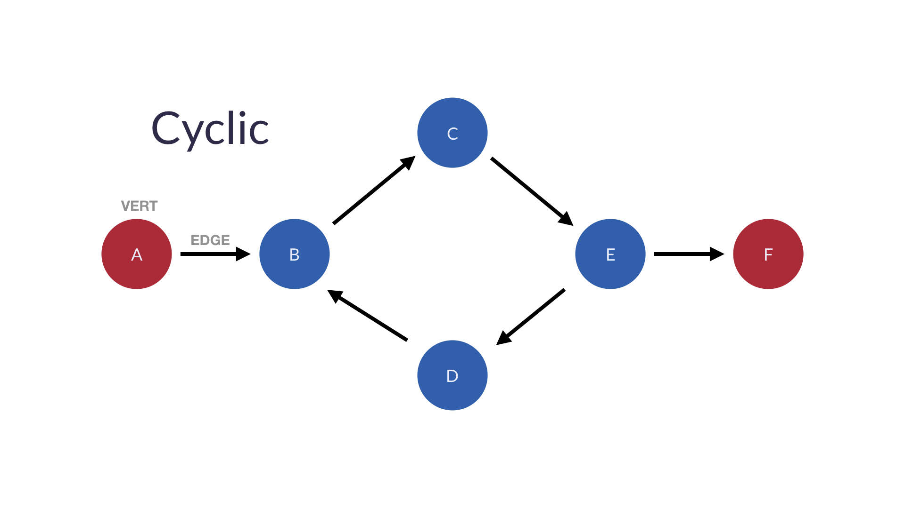
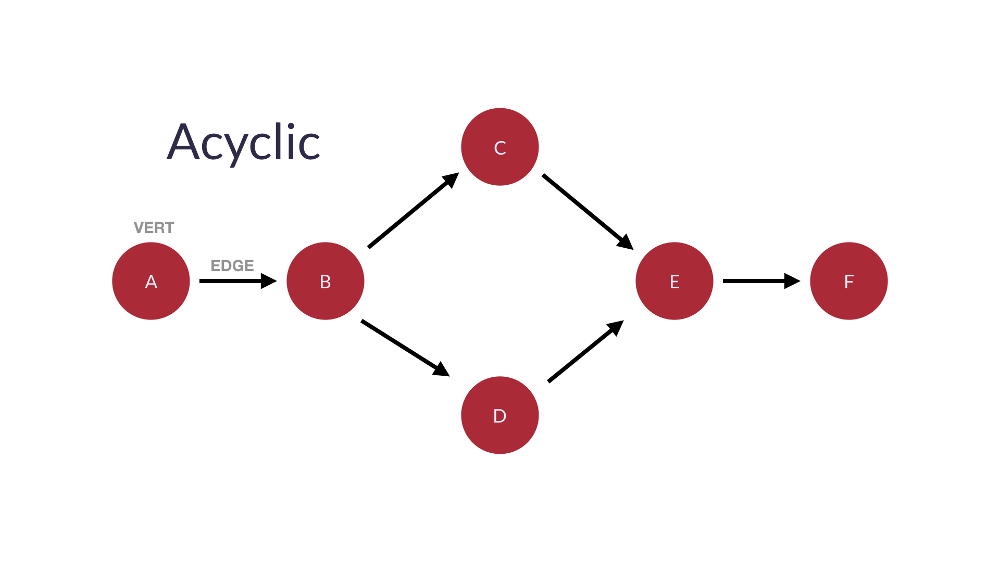
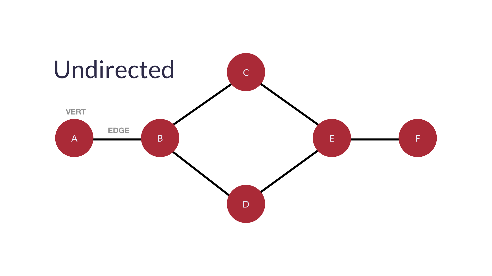

# GRAPHS

A `Graph` is a type of data structure that stores networked data. It is composed of the following elements:

1. `Nodes` (or `Vertices`) that represent points on the graph
2. `Edges` that represent the path from one node to another

## TABLE OF CONTENTS

- [Sub-types of Graphs](#sub-types-of-graphs)
  - [Directed Graphs](#directed-graphs)
  - [Undirected Graphs](#undirected-graphs)
- [Implementations](#implementations)
- [Type](#type)
- [Data Structure Description](#data-structure-description)
- [Space and Time Complexity](#space-and-time-complexity)

## SUB-TYPES OF GRAPHS

##### DIRECTED GRAPHS

A `Directed Graph` stores networked data, but it differs from [Undirected Graphs](#undirected-graphs) in that a `Directed Graph` has at _least_ one edge that is _not_ bi-directional. It is composed of the following elements:

1. `Nodes` (or `Vertices`) that represent points on the graph
2. `Edges` that represent the path from one node to another

In a `Directed Graph`, data is stored in a way where nodes on a graph can have relationships to each other. Examples of this include streets that have cars going both way or people in a network of friends who owe other members money.

Here's an example of a one-way directed graph:

Here's an example of a bi-directional directed graph:

    

A directed graph may also take two other variations:

1. `Cyclic`, where you may cycle through any given point in the graph to another point

2. `Acyclic`, where you may only traverse one direction in the graph from a given point and may not return to it

##### UNDIRECTED GRAPHS

An `Undirected Graph` also stores networked data, but it differs from [Directed Graphs](#directed-graphs) in that an `Undirected Graph` contains `edges` that are _all_ bi-directional. It is composed of the following elements:

1. `Nodes` (or `Vertices`) that represent points on the graph
2. `Edges` that represent the path from one node to another

In an `Undirected Graph`, data is stored in a way where nodes on a graph always have a bi-directional relationship with each other.

Here's an example of a one-way directed graph:

## IMPLEMENTATIONS

- [JavaScript](graph.js)
- [Python](graph.py)

## TYPE

`Graphs` are a unique data structure that are multi-purpose in nature for many different problem solutions.

## DATA STRUCTURE DESCRIPTION

They are formed by linking together `nodes` (or `vertices`) with `edges`. `Graphs` are like [Trees](../tree), except that any single `node` on a `Tree` can connect to any other single `node`.

All [Trees](../tree) are `Graphs`, but not all `Graphs` are `Trees`.

## SPACE AND TIME COMPLEXITY

Time complexity for `Graphs` is generally `O(|V| + |E|)`, where `|V|` represents the complete list of `nodes` and `|E|` represents some given set of `edges`.

Space complexity is also `O(|V| + |E|)`.
