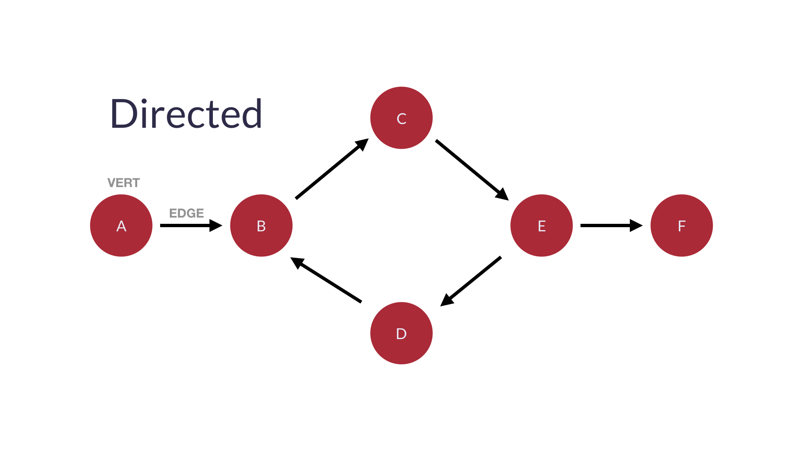
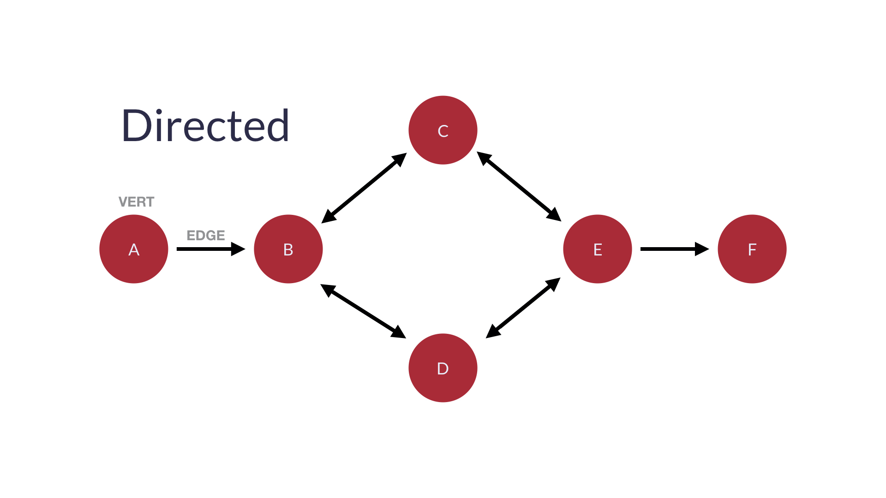

# DIRECTED GRAPHS

A `Graph` is a type of data structure that stores networked data. It is composed of the following elements:

1. `Nodes` (or `Vertices`) that represent points on the graph
2. `Edges` that represent the path from one node to another

In a `Directed Graph`, data is stored in a way where nodes on a graph can have relationships to each other. Examples of this include streets that have cars going both way or people in a network of friends who owe other members money.

#### EXAMPLES

Here's an example of one-way directed graph:

Here's an example of a bi-directional directed graph:

    

A directed graph may also take two other forms:

1. `Cyclic`, where you may cycle through any given point in the graph to another point
2. `Acyclic`, where you may only traverse one direction in the graph from a given point and may not return to it

## TABLE OF CONTENTS

- [Directed Graphs](directed)
  - [Directed Cyclic Graphs](directed/cyclic)
  - [Directed Acyclic Grpahs](directed/acyclic)
- [Undirected Graphs](undirected)
